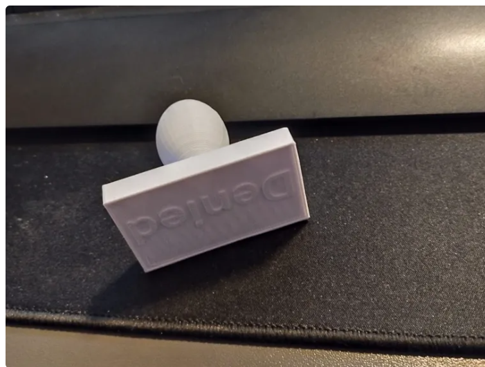
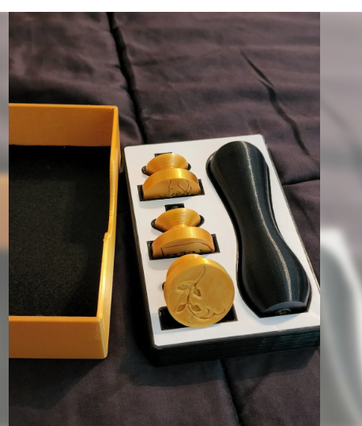
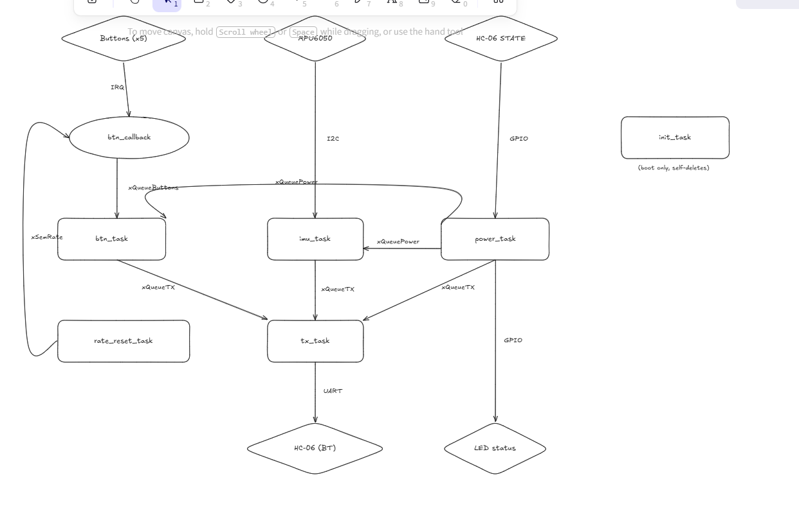

# Controle Customizado — Papers, Please

**APS 2 + Expert (Bluetooth + RTOS) | Computação Embarcada — Insper**

---

## 1. O Jogo

[**Papers, Please**](https://store.steampowered.com/app/239030/Papers_Please/) é um jogo de simulação no qual o jogador atua como um inspetor de imigração da fictícia Arstotzka. A jogabilidade gira em torno de examinar documentos de viajantes, comparar informações, e decidir entre **aprovar** ou **negar** a entrada — carimbando o passaporte. Eventualmente o inspetor também precisa **interrogar** ou **revistar** suspeitos.

As ações principais do jogo são:

- Mover o cursor para inspecionar documentos.
- Clicar para arrastar documentos pela mesa.
- Carimbar **APROVADO** (tecla `A`).
- Carimbar **NEGADO** (tecla `X`).
- Interrogar/revistar (tecla `I`).

---

## 2. Ideia do Controle

O controle é um dispositivo físico **sem fio** que substitui o teclado e o mouse para jogar Papers, Please. A intenção é que o jogo seja jogado da forma mais imersiva possível: o jogador segura o controle como se fosse a prancheta do inspetor, **inclina o controle** para mover o cursor (via IMU) e **pressiona botões físicos dedicados** para os carimbos e ações.

O controle se comunica com o PC via **Bluetooth (HC-06)**. Um script Python no computador escuta as mensagens do controle e as traduz em eventos reais de teclado e mouse no sistema operacional.

O firmware roda em uma **Raspberry Pi Pico** com **FreeRTOS**, sem variáveis globais de estado — toda comunicação entre tasks é feita via filas e semáforos.

### Imagens


ideias: 




---

## 3. Entradas e Saídas

### Entradas (sensores e botões)

| Entrada | Tipo | Função no jogo |
|---|---|---|
| **MPU6050 (IMU)** | Analógico (I2C) | Giroscópio — inclinar o controle move o cursor do mouse |
| **Botão APPROVE** | Digital (IRQ) | Carimba **APROVADO** (tecla `A`) |
| **Botão DENY** | Digital (IRQ) | Carimba **NEGADO** (tecla `X`) |
| **Botão CLICK** | Digital (IRQ) | Clique esquerdo (selecionar/arrastar documentos) |
| **Botão INSPECT** | Digital (IRQ) | Interrogar / revistar (tecla `I`) |
| **Botão POWER** | Digital (IRQ) | Liga/desliga o controle |
| **HC-06 STATE** | Digital (entrada) | Sinaliza se o BT está pareado com o PC |

> Todas as entradas digitais operam por **callback / interrupção** (nenhuma é lida por polling).

### Saídas (atuadores)

| Saída | Tipo | Função |
|---|---|---|
| **LED de status** | Digital | Aceso = Bluetooth conectado ao PC; apagado = desconectado |
| **HC-06 (UART TX)** | Serial sem fio | Envia eventos do controle para o PC |
| **HC-06 ENABLE** | Digital | Habilita/desabilita o módulo BT |

### Pinagem (Raspberry Pi Pico)

| Pino | Função |
|---|---|
| `GP3` | HC-06 STATE (in) |
| `GP4` | UART1 TX → HC-06 RXD |
| `GP5` | UART1 RX ← HC-06 TXD |
| `GP6` | HC-06 ENABLE |
| `GP8` | I2C0 SDA — MPU6050 |
| `GP9` | I2C0 SCL — MPU6050 |
| `GP16` | Botão APPROVE |
| `GP17` | Botão DENY |
| `GP18` | Botão CLICK |
| `GP19` | Botão INSPECT |
| `GP20` | Botão POWER |
| `GP25` | LED de status |

---

## 4. Protocolo de Comunicação

A comunicação entre o controle e o PC é feita por **UART sem fio (HC-06 → Bluetooth SPP → porta COM no PC)** usando um protocolo de **texto ASCII orientado a linha**, onde cada evento ocupa **uma linha terminada por `\n`**.

### Formato geral

```
<TIPO>,<arg1>[,<arg2>]\n
```

### Mensagens definidas

| Mensagem | Direção | Significado | Exemplo |
|---|---|---|---|
| `M,dx,dy\n` | Controle → PC | Movimento relativo do mouse (em pixels, com sinal). `dx` e `dy` são limitados a ±12. | `M,-3,5\n` |
| `BD,n\n` | Controle → PC | Botão `n` foi **pressionado** (button down) | `BD,1\n` |
| `BU,n\n` | Controle → PC | Botão `n` foi **solto** (button up) | `BU,1\n` |
| `PWR,1\n` | Controle → PC | Controle foi **ligado** | `PWR,1\n` |
| `PWR,0\n` | Controle → PC | Controle foi **desligado** | `PWR,0\n` |

### Mapeamento de botões (`n`)

| `n` | Botão | Ação no PC |
|---|---|---|
| `1` | APPROVE | Tecla `A` |
| `2` | DENY | Tecla `X` |
| `3` | CLICK | Botão esquerdo do mouse |
| `4` | INSPECT | Tecla `I` |

### Parâmetros do canal serial

| Parâmetro | Valor |
|---|---|
| Baud rate | 9600 |
| Data bits | 8 |
| Stop bits | 1 |
| Paridade | nenhuma |
| Controle de fluxo | nenhum |
| Terminador | `\n` (LF) |

### Justificativa do protocolo

Optamos por texto ASCII (em vez de pacotes binários) por três motivos:

1. **Debug fácil** — basta abrir um monitor serial pra ver os eventos chegando.
2. **Parser trivial no PC** — `line.split(",")` resolve.
3. **Robustez a ruído** — como cada evento termina em `\n`, um byte corrompido descarta no máximo uma linha (sem dessincronizar o stream).

O **rate limiting** (20 eventos/s) e o **clamp de movimento** (±12 px) já são aplicados no firmware antes de empacotar a mensagem, então o protocolo carrega apenas dados já saneados.

---

## 5. Diagrama de Blocos do Firmware




### Tasks

| Task | Prio | O que faz |
|---|---|---|
| `init_task` | 4 | Configura UART e envia comandos AT (`AT+NAME`, `AT+PIN`) ao HC-06; se autodeleta |
| `tx_task` | 3 | Consome `xQueueTX` e escreve byte a byte na UART do HC-06 |
| `power_task` | 2 | Trata botão POWER e atualiza o LED com o pino STATE do HC-06 |
| `rate_reset_task` | 2 | Dá `give` no semáforo de rate limiting 1×/s |
| `imu_task` | 1 | Lê MPU6050 a ~100 Hz, faz clamp e enfileira `M,dx,dy\n` |
| `btn_task` | 1 | Consome `xQueueButtons`, aplica debounce de 50 ms e enfileira `BD/BU,n\n` |

### ISR

| Callback | Disparada por | O que faz |
|---|---|---|
| `btn_callback` | IRQ de qualquer um dos 5 botões | Toma `xSemRate` (descarta se cheio), monta evento com pino+estado+timestamp e dá `xQueueSendFromISR` em `xQueueButtons`. Mantida com <10 instruções. |

### Filas e semáforos

| Recurso | Tipo | Função |
|---|---|---|
| `xQueueButtons` | Fila | Eventos crus de botão (ISR → `btn_task`) |
| `xQueueTX` | Fila | Bytes a serem transmitidos pela UART (qualquer task → `tx_task`) |
| `xQueuePower` | Fila (1 slot, `xQueueOverwrite`) | Estado liga/desliga do controle (`power_task` → `imu_task` e `btn_task`) |
| `xSemRate` | Semáforo de contagem | Rate limiting (recarregado por `rate_reset_task`, consumido por `btn_callback`) |

---

## 6. Software no PC (`controller.py`)

Script Python que:

- Abre a porta COM/rfcomm criada ao parear o HC-06.
- Lê as linhas do controle.
- Converte `M,dx,dy` em `pyautogui.moveRel()`.
- Converte `BD/BU,n` em `keyDown/keyUp` ou `mouseDown/mouseUp`.
- Aplica uma 2ª camada de rate limiting (consistente com o firmware).
- Ao encerrar (Ctrl+C), libera qualquer tecla/botão que esteja "presa".

```bash
pip install pyserial pyautogui

python controller.py COM4          # Windows
python controller.py /dev/rfcomm0  # Linux
```

---

## 7. Anti-cheat (camadas de proteção)

1. **Debounce de 50 ms por botão** — implementado em `btn_task` (não na ISR) com timestamps locais.
2. **Rate limiting de 20 eventos/s** — semáforo de contagem tomado na ISR e recarregado por task dedicada.
3. **Clamp de movimento do mouse** — `|dx|, |dy| ≤ 12 px` por tick, impedindo saltos absurdos do cursor.

---

## 8. Conformidade — Regras de qualidade

| Regra | Descrição | Status |
|---|---|---|
| 1.1 | Globais apenas para ISR | ✅ Zero globais de estado |
| 1.2 | Globais de ISR com `volatile` | ✅ N/A — não há globais de ISR |
| 1.3 | Sem globais desnecessárias | ✅ |
| 3.0 | Sem `delay` dentro de ISR | ✅ |
| 3.1 | Sem display dentro de ISR | ✅ |
| 3.2 | Sem `printf` dentro de ISR | ✅ |
| 3.3 | Sem loops dentro de ISR | ✅ |
| 4.1 | `FromISR` dentro de callbacks | ✅ `xSemaphoreTakeFromISR`, `xQueueSendFromISR` |
| 4.2 | API normal dentro de tasks | ✅ |
| 4.3 | `vTaskDelay` em todas as tasks | ✅ |
| 4.4 | Sem globais entre tasks | ✅ Comunicação só via filas/semáforos |

---

## 9. Expert escolhidos

- **Bluetooth (HC-06):** controle 100% sem fio; HC-06 configurado por AT no boot; LED reflete diretamente o pino STATE do módulo.
- **RTOS avançado:** 6 tasks com prioridades distintas, 3 filas, 1 semáforo de contagem, comunicação inter-task exclusivamente por primitivas FreeRTOS.

---

## 10. Estrutura de arquivos

```
.
├── main.c            # Firmware da Pico (FreeRTOS)
├── CMakeLists.txt    # Build system
├── controller.py     # Script no PC
├── docs/             # Imagens e documentação
└── README.md
```
