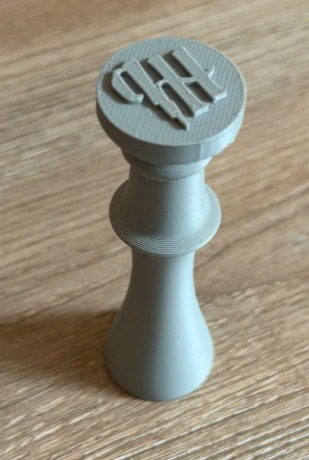
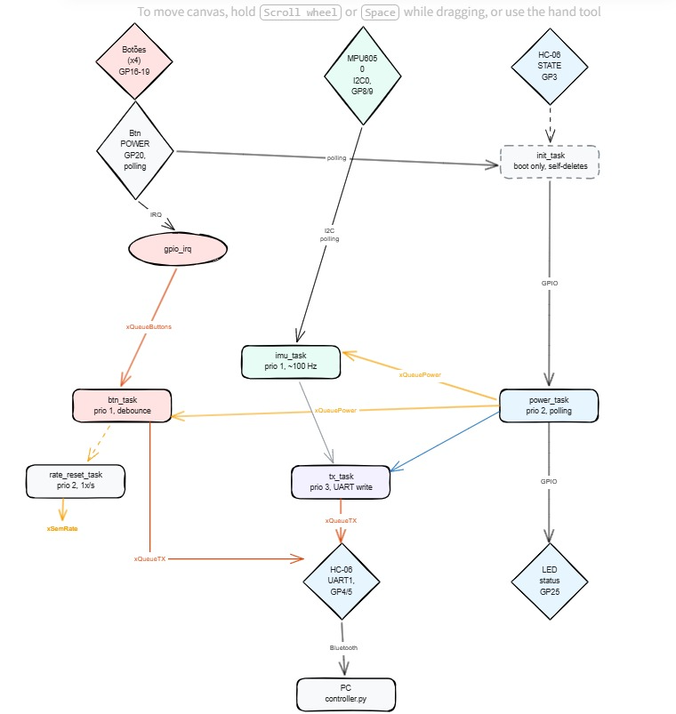

# Controle Customizado — Papers, Please

**APS 2 + Expert (Bluetooth + RTOS) | Computação Embarcada — Insper**

---

##  1. O Jogo

Papers, Please é um jogo de simulação no qual o jogador atua como um inspetor de imigração da fictícia Arstotzka. A jogabilidade gira em torno de examinar documentos de viajantes, comparar informações, e decidir entre aprovar ou negar a entrada — carimbando o passaporte. Eventualmente o inspetor também precisa interrogar ou revistar suspeitos.

As ações principais do jogo são:

- Mover o cursor para inspecionar documentos.
- Clicar para arrastar documentos pela mesa.
- Carimbar APROVADO (tecla A).
- Carimbar NEGADO (tecla X).
- Interrogar/revistar (tecla I).

**Link do Jogo:** [Papers, Please na Steam](https://store.steampowered.com/app/239030/Papers_Please/)

---
##  2. Ideia do Controle

O controle é um dispositivo físico com fio que substitui o teclado e o mouse para jogar Papers, Please. A intenção é que o jogo seja jogado da forma mais imersiva possível: o jogador segura o controle como se fosse a prancheta do inspetor, inclina o controle para mover o cursor (via IMU/giroscópio) e pressiona botões físicos dedicados para os carimbos e ações.

Os dois botões principais — APPROVE (verde) e DENY (vermelho) — imitam os carimbos físicos do jogo, tornando a experiência intuitiva e temática. O botão CLICK permite arrastar e soltar documentos na mesa, e o botão INSPECT aciona interrogação ou revista.

O controle se comunica com o PC via USB (UART), com um script Python no computador escutando as mensagens do controle e as traduzindo em eventos reais de teclado e mouse no sistema operacional.

O módulo de IA embarcada é utilizado para detectar gestos específicos de movimento da IMU — como um gesto de "carimbar" (movimento brusco para baixo) — disparando automaticamente as ações de APPROVE ou DENY sem precisar pressionar botão.

---

### Imagens


ideias: 



---

## 3. Entradas e Saídas

### Entradas (sensores e botões)

| Entrada | Tipo | Função no jogo |
|---|---|---|
| MPU6050 (IMU) | Analógico (I2C) | Giroscópio — inclinar o controle move o cursor do mouse |
| Botão APPROVE | Digital (IRQ) | Carimba APROVADO (tecla A) |
| Botão DENY | Digital (IRQ) | Carimba NEGADO (tecla X) |
| Botão CLICK | Digital (IRQ) | Clique esquerdo (selecionar/arrastar documentos) |
| Botão INSPECT | Digital (IRQ) | Interrogar / revistar (tecla I) |
| Botão POWER | Digital (polling) | Liga/desliga o controle |

> Os botões de ação (APPROVE, DENY, CLICK, INSPECT) operam por **callback / interrupção**.
> O botão POWER é monitorado por **polling** dentro da `power_task` via `gpio_get()`.

### Saídas (atuadores)

| Saída | Tipo | Função |
|---|---|---|
| LED de status | Digital | Aceso = Bluetooth conectado ao PC; apagado = desconectado |
| HC-06 (UART TX) | Serial sem fio | Envia eventos do controle para o PC |
| HC-06 ENABLE | Digital | Habilita modo AT para configuração no boot |

---

##  4. Protocolo de Comunicação

A comunicação entre o controle e o PC é feita por **UART sem fio** (HC-06 → Bluetooth SPP → porta COM no PC) usando um protocolo de texto ASCII orientado a linha, onde cada evento ocupa uma linha terminada por `\n`.

### Formato geral

```
<TIPO>,<arg1>[,<arg2>]\n
```


### Mensagens definidas

| Mensagem | Direção | Significado | Exemplo |
|---|---|---|---|
| `M,dx,dy\n` | Controle → PC | Movimento relativo do mouse (pixels, com sinal). `dx` e `dy` limitados a ±12. | `M,-3,5\n` |
| `BD,n\n` | Controle → PC | Botão n foi pressionado (button down) | `BD,1\n` |
| `BU,n\n` | Controle → PC | Botão n foi solto (button up) | `BU,1\n` |
| `PWR,1\n` | Controle → PC | Controle foi ligado | `PWR,1\n` |
| `PWR,0\n` | Controle → PC | Controle foi desligado | `PWR,0\n` |


### Mapeamento de botões (n)

| n | Botão | Ação no PC |
|---|---|---|
| 1 | APPROVE | Tecla A |
| 2 | DENY | Tecla X |
| 3 | CLICK | Botão esquerdo do mouse |
| 4 | INSPECT | Tecla I |


### Parâmetros do canal serial

| Parâmetro | Valor |
|---|---|
| Baud rate | 9600 |
| Data bits | 8 |
| Stop bits | 1 |
| Paridade | nenhuma |
| Controle de fluxo | nenhum |
| Terminador | `\n` (LF) |

### Justificativa do protocolo

Optamos por texto ASCII (em vez de pacotes binários) por três motivos:

1. **Debug fácil** — basta abrir um monitor serial para ver os eventos chegando.
2. **Parser trivial no PC** — `line.split(",")` resolve.
3. **Robustez a ruído** — como cada evento termina em `\n`, um byte corrompido descarta no máximo uma linha, sem dessincronizar o stream.

O rate limiting (20 eventos/s) e o clamp de movimento (±12 px) já são aplicados no firmware antes de empacotar a mensagem, então o protocolo carrega apenas dados já saneados.

---

## 5. Diagrama de Blocos do Firmware




### Tasks

| Task | Prioridade | O que faz |
|---|---|---|
| `init_task` | 4 | Configura UART e envia comandos AT (`AT+NAME`, `AT+PIN`) ao HC-06; se auto-deleta após o boot |
| `tx_task` | 3 | Consome `xQueueTX` e escreve byte a byte na UART do HC-06 |
| `power_task` | 2 | Trata botão POWER por polling; atualiza LED com o pino STATE do HC-06; envia `PWR,n\n` |
| `rate_reset_task` | 2 | Dá `give` no semáforo de rate limiting 1×/s |
| `imu_task` | 1 | Lê MPU6050 a ~100 Hz, calibra no boot, aplica clamp e enfileira `M,dx,dy\n` |
| `btn_task` | 1 | Consome `xQueueButtons`, aplica debounce de 50 ms e enfileira `BD/BU,n\n` |

> No boot há 6 tasks ativas. Após a inicialização do HC-06, a `init_task` se auto-deleta e o sistema opera com 5 tasks em regime estacionário.

### ISR

| Callback | Disparada por | O que faz |
|---|---|---|
| `btn_callback` | IRQ de qualquer um dos 4 botões de ação | Toma `xSemRate` (descarta se cheio), monta evento com pino + estado + timestamp e dá `xQueueSendFromISR` em `xQueueButtons`. Mantida com menos de 10 instruções. |

### Filas e semáforos

| Recurso | Tipo | Função |
|---|---|---|
| `xQueueButtons` | Fila | Eventos crus de botão (ISR → `btn_task`) |
| `xQueueTX` | Fila | Bytes a serem transmitidos pela UART (qualquer task → `tx_task`) |
| `xQueuePower` | Fila (1 slot, `xQueueOverwrite`) | Estado liga/desliga do controle (`power_task` → `imu_task` e `btn_task`) |
| `xSemRate` | Semáforo de contagem | Rate limiting (recarregado por `rate_reset_task`, consumido por `btn_callback`) |

---

## 6. Software no PC (`controller.py`)

Script Python que:

- Abre a porta COM/rfcomm criada ao parear o HC-06.
- Lê as linhas do controle.
- Converte `M,dx,dy` em `pyautogui.moveRel()`.
- Converte `BD/BU,n` em `keyDown/keyUp` ou `mouseDown/mouseUp`.
- Aplica uma 2ª camada de rate limiting (consistente com o firmware).
- Ao encerrar (Ctrl+C), libera qualquer tecla/botão que esteja pressa.


---


##  9. Expert escolhidos

**Bluetooth (HC-06):** controle 100% sem fio. O HC-06 é configurado automaticamente no boot via comandos AT (`AT+NAME PapersPlease-Ctrl`, `AT+PIN 1234`). O LED de status reflete diretamente o pino STATE do módulo, indicando conexão real com o PC — não um estado interno do firmware.

**RTOS avançado:** 6 tasks no boot (5 em operação), com prioridades distintas, 3 filas, 1 semáforo de contagem. Comunicação inter-task exclusivamente por primitivas FreeRTOS — nenhuma variável global de estado.

---
